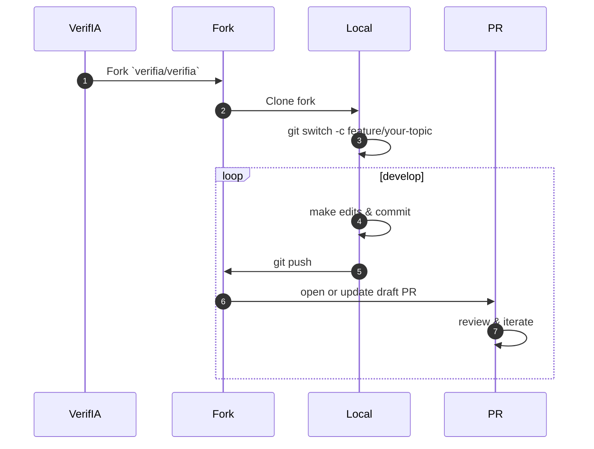
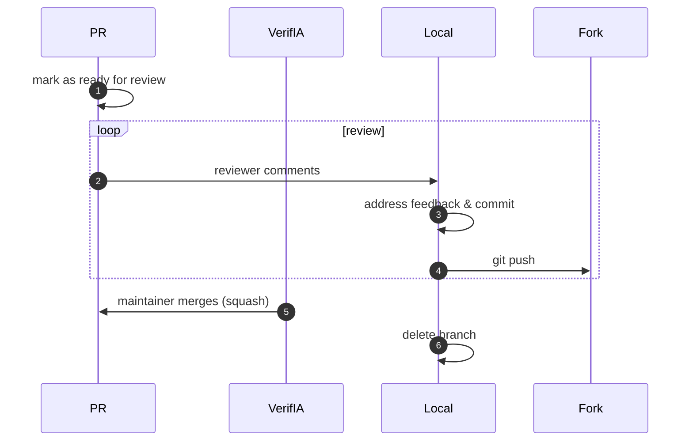

# Making a Pull Request

You can contribute to *VerifIA* by opening a [pull request] against the main repository. Your changes—whether bug fixes, documentation improvements, or new features—will be reviewed by the maintainers and merged once approved.

[pull request]: https://github.com/verifia/verifia/pulls

!!! note "Before you begin"
    - If you’ve found a bug, please open an [issue] first.
    - For documentation updates, open a [docs issue].
    - For new features or behavior changes, open a [feature request].
    - Discuss your plan on the issue tracker so we can advise on scope and approach.

[issue]: https://github.com/verifia/verifia/issues  
[docs issue]: https://github.com/verifia/verifia/issues/new?labels=documentation  
[feature request]: https://github.com/verifia/verifia/issues/new?labels=enhancement  

---

## 1. Learn the Workflow

Before creating a pull request, get familiar with GitHub’s PR concepts:

1. [Fork a repository]  
2. [Clone your fork]  
3. [Create a branch]  
4. [Push to your branch]  
5. [Open a pull request]

[Fork a repository]: https://docs.github.com/en/get-started/quickstart/fork-a-repo  
[Clone your fork]: https://docs.github.com/en/repositories/creating-and-managing-repositories/cloning-a-repository  
[Create a branch]: https://docs.github.com/en/pull-requests/collaborating-with-pull-requests/proposing-changes-to-your-work-with-pull-requests/creating-and-deleting-branches-within-your-repository
[Push to your branch]: https://docs.github.com/en/get-started/using-git/pushing-commits-to-a-remote-repository  
[Open a pull request]: https://docs.github.com/en/pull-requests/collaborating-with-pull-requests/proposing-changes-to-your-work-with-pull-requests  

---

## 2. Pull Request Process

### 2.1 Prepare your changes



1. **Fork** the [VerifIA repo] `verifia/verifia`.
2. **Clone** your fork locally:

   ```bash
   git clone git@github.com:<your_username>/verifia.git
   cd verifia
   ```
3. **Branch** for your work:

   ```bash
   git switch -c feature/describe-your-change
   ```
4. **Develop** with small, focused commits.

5. **Push** often to your fork:

   ```bash
   git push -u origin feature/describe-your-change
   ```
6. **Open** a **draft** PR as soon as you have something to show, while referencing an issue.

[VerifIA repo]: https://github.com/verifia/verifia

### 2.2 Keep in sync

If upstream `main` has new commits, merge them into your branch:

```bash
git remote add upstream https://github.com/verifia/verifia.git
git fetch upstream
git merge upstream/main
git push
```

---

## 3. Finalizing Your Pull Request



1. Change **from draft** to **ready for review**.
2. Receive reviews from a maintainer.
3. Address feedback promptly with commits to your branch.
4. Once approved, a maintainer will merge (often squashing commits).

---

## 4. After Merge

1. Delete your topic branch both locally and on GitHub:

   ```bash
   git switch main
   git pull upstream main
   git branch -d feature/describe-your-change
   git push origin --delete feature/describe-your-change
   ```
2. You’re ready for your next contribution!

---

## Dos and Don’ts

* [x] **Do** explain *why* you’re making changes.
* [x] **Do** reference related issues and discussions.
* [x] **Do** write clear, descriptive commit messages.
* [ ] **Don’t** submit huge, unreviewable diffs—keep PRs small.
* [ ] **Don’t** forget to merge upstream changes before finalizing.

---

_Thank you for helping build the *VerifIA* community!_ 🎉

