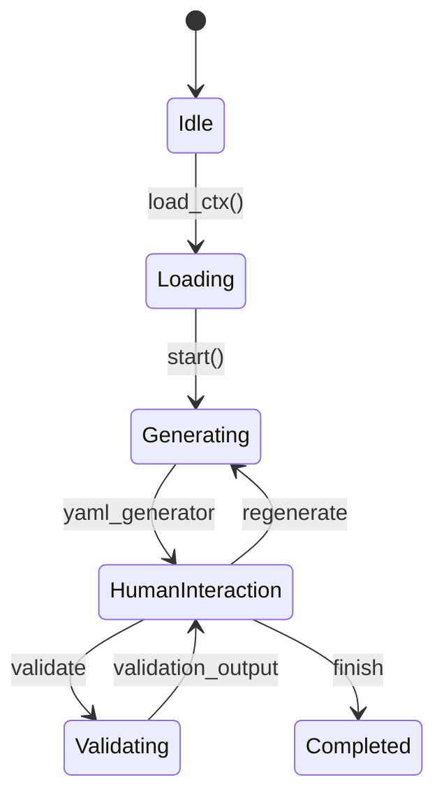

# Domain GenFlow

The Domain GenFlow component in *VerifIA* automates the creation of domain specifications—**variables**, **constraints**, 
and **rules**—by harnessing **Large Language Models (LLMs)**, multi-agent orchestration , and an interactive human‑in‑the‑loop (HITL) UI. 
Instead of hand‑crafting YAML, you simply point DomainGenFlow at your data (CSV, DataFrame) and documentation (PDFs, vector database), 
and it synthesizes a draft domain spec that you can review and refine, and validate through an integrated Gradio interface.

Manually defining a Domain Specification involves:

- Enumerating **feature variables** with types, ranges, and descriptions  
- Writing **constraints** that all data must satisfy  
- Crafting **rules** that describe logical relationships between inputs and the target  

!!! warning "Manual Effort & Risk"
    As model complexity and business rules evolve, manual specification is error‑prone and time‑intensive.

Domain GenFlow standardizes and accelerates this process by orchestrating LLM‑powered agents, while keeping you in control via a simple UI.

---

## 1. Domain Specification

A **Domain Specification** codifies how a model should behave within a particular context. It comprises three core elements:

- **Variables**: Input features with types (e.g., numerical, categorical), permissible ranges or categories, and descriptions.
- **Constraints**: Conditions that all data points must satisfy (e.g., `age >= 0`, `balance > 0`).
- **Rules**: Logical relationships describing how inputs influence the target (premises → conclusion).

This specification guides verification by clearly defining the expected behavior of the model under various conditions.

---

## 2. Core Components: LLM‑Powered Agents

*VerifIA*'s Domain GenFlow employs two specialized agent types, each powered by LLMs via LangChain:

2.1. **DataFrame Analysis Agents:** extends LangChain's pandas DataFrame agent to:

- Automatically detect feature types (categorical, numerical).
   
- Identify statistical properties (min, max, value ranges).
      
- Infer data-driven constraints and domain rules relevant for model verification.

2.2. **Retriever Agents:** Search external documents (e.g., PDF reports) to:

- extract domain knowledge from unstructured documentation.

- Identify explicit constraints and domain rules described in documents.

- Provide rich textual descriptions of features and target variables.

!!! abstract "Goal"
    These agents collaboratively operate in a graph-based workflow powered by **LangGraph**, merging insights from 
    structured data and unstructured domain documentation into a cohesive domain specification.

---

## 3. Orchestration via StateGraph

The AI-based Domain Generation feature is orchestrated via a **LangGraph StateGraph**, which manages the workflow as follows:

1. **Parallel Branches**: DataFrame and Retriever agents run concurrently for variables, constraints, and rules.
2. **YAML Generation Node**: Merges agent outputs into a draft specification in JSON/YAML format.
3. **Human‑In‑The‑Loop (HITL) Interaction Node**: Pauses execution, exposing the draft YAML and validator output for user edits or instructions.
4**Validation Node**: Parses the draft against a Pydantic schema and runs rule-consistency checks. On validation errors, 
control returns to HITL node for retry or regeneration. On success, the graph reaches `END`.

???+ info "LangGraph Visualization"
    ````mermaid
    ---
    config:
      flowchart:
        curve: linear
    ---
    graph TD;
        __start__([<p>__start__</p>]):::first
        analyser_variables(analyser_variables)
        retriever_variables(retriever_variables)
        analyser_constraints(analyser_constraints)
        retriever_constraints(retriever_constraints)
        analyser_rules(analyser_rules)
        retriever_rules(retriever_rules)
        yaml_generator(yaml_generator)
        human_interaction(human_interaction)
        yaml_validator(yaml_validator)
        __end__([<p>__end__</p>]):::last
        __start__ --> analyser_constraints;
        __start__ --> analyser_rules;
        __start__ --> analyser_variables;
        __start__ --> retriever_constraints;
        __start__ --> retriever_rules;
        __start__ --> retriever_variables;
        analyser_variables -.-> yaml_generator;
        retriever_variables -.-> yaml_generator;
        analyser_constraints -.-> yaml_generator;
        retriever_constraints -.-> yaml_generator;
        analyser_rules -.-> yaml_generator;
        retriever_rules -.-> yaml_generator;
        yaml_generator -.-> human_interaction;
        human_interaction -.-> yaml_generator;
        human_interaction -.-> yaml_validator;
        human_interaction -.-> __end__;
        yaml_validator -.-> human_interaction;
        classDef default fill:#f2f0ff,line-height:1.2
        classDef first fill-opacity:0
        classDef last fill:#bfb6fc
    ````

---

## 4. Usage Workflow



1. **Context Loading**  
    - Read CSV or DataFrame  
      - Build or load Chroma vector store from PDFs or text  
      - Load model‑card metadata  
2. **Graph Construction**  
    - Register analysis + retrieval nodes in a StateGraph  
3. **Execution**  
    - Invoke graph: agents run, outputs accumulate in `DomainGraphState`  
      - YAML generator merges insights into an initial draft YAML
      - HumanInteraction Node (via The Gradio UI) displays draft YAML
      - You can **Validate**, **Regenerate** with custom instructions, or **Finish**.
      - Validator checks schema and rule consistency
4. **Output**   

    !!! success "Automated Domain Spec"
        On success, you receive a ready‑to‑use YAML file with full domain definitions.

    !!! failure "Automated Domain Spec"
        On failure, loops back to interactive review until resolved

---

## 5. Interactive Gradio UI

[//]: # (Below is a placeholder for the Domain Spec Generator interface:)

[//]: # ()
[//]: # (![Domain Spec Generator UI]&#40;path/to/ui-screenshot.png&#41;)

The Gradio UI component consists of:

- **YAML Specification Panel**: An interactive code view showing the current draft of the YAML spec.

- **Instructions Box**: A textbox where you can enter custom instructions for regeneration.

- **Validation Output**: Displays schema and consistency check messages.

- **Action Buttons**:
    - 🚀 **Start Generation**: Kick off the domain spec generation.
      - ✅ **Validate**: Run the validator on the current YAML.
      - 🔄 **Regenerate**: Regenerate the YAML with your custom instructions.
      - 🎉 **Finish**: Complete the process and produce the final spec.

Use this interface to iteratively refine and finalize your domain specification.

---

## 6. YAML Specification Format

The final output from AI-based domain generation is structured as a YAML Specification:

!!! example "example of a YAML Specification"
    ````yaml
    variables:
      age:
        description: "Age of the applicant"
        type: INT
        range: [18, 65]
    constraints:
      positive_balance:
        description: "Account balance must always be positive"
        formula: "account_balance > 0"
    rules:
      credit_risk_rule:
        description: "Higher debt-to-income ratio increases credit risk"
        premises:
          debt_income_ratio: inc
        conclusion:
          credit_risk: inc
    ````

---

## 7. Next Steps / Pointers

- Review and refine the generated YAML using the UI.   
- Integrate `domain_spec.yaml` into your *VerifIA* verification pipeline.  
- Provide feedback on edge‑case handling and retriever performance.

---

## 8. Human‑AI Collaboration & Error Handling

While AI automates much of the specification process, **human review remains essential**:

- **Validation Errors:** Fix YAML syntax or schema mismatches via UI instructions.  
- **Logical Consistency:** Ensure rules accurately reflect domain knowledge.  
- **Iterative Tuning:** Adjust prompts, model settings, or input data and retry.  

!!! success "Human‑AI Collaboration"
    Your domain expertise combined with AI efficiency yields reliable, production‑ready specifications.