# Generating a Domain YAML File using AI

This guide shows you how to use AI-powered *VerifIA* feature, **Domain Genflow** that generates the **domain specification** 
Instead of manually crafting it as described in [Domain Creation](/guides/creating-a-domain). 
For a deeper conceptual overview of Domain Genflow in *VerifIA*, see [Concepts → Domain Genflow](/concepts/domain-genflow).

---

## Why Using AI for Domain Generation?

Crafting a Domain Specification manually means:

* Enumerating **feature variables** with types, ranges, and descriptions
* Writing **constraints** that all inputs must satisfy
* Defining **rules** that express logical relationships between inputs and the target

As your models and business logic grow more complex, this process becomes **time‑consuming**, **error‑prone**, and hard to maintain.

> **Solution:** *VerifIA* automates and orchestrates LLM‑powered agents to extract domain knowledge from both **structured** (DataFrame) and **unstructured** (PDF, Markdown) sources, delivering:

* **Efficiency:** Free your team from tedious YAML editing.
* **Accuracy:** Leverage AI’s pattern recognition to reduce human inconsistency.
* **Scalability:** Reuse the workflow across diverse datasets and domains.

---

## Feature Overview

```mermaid
%%{init:{
  'flowchart': {
    'useMaxWidth': true,
    'nodeSpacing': 50,
    'rankSpacing': 22
  }
}}%%
flowchart LR
  %%—— Subgraphs for each layer —————————————————————————————————————
  subgraph InputLayer[📥 **Input Layer**]
    direction LR
    A[🗂️<br/>Data]
    C[📋<br/>Model<br/>Card]
    B[📄<br/>Docs]
  end

  subgraph AgentLayer[🤖 **Agent Layer**]
    direction LR
    D[🐼<br/>DataFrame<br/>Agents]
    E[📖<br/>Retriever<br/>Agents]
  end

  subgraph CoreLayer[⚙️ **Core**]
    direction LR
    F[🛠️<br/>State<br/>Graph]
  end

  subgraph GenValLayer[🔄 **Generation & Validation**]
    direction LR
    G[📝<br/>YAML<br/>Generator]
    J[🤝<br/>**Human**<br/>**UI**]
    H[🔍<br/>Schema<br/>Validator]
  end

  subgraph ExportLayer[📤 **Export**]
    direction LR
    I[📦<br/>Domain<br/>Spec]
  end

  %%—— Arrows between layers —————————————————————————————————————
  A --> D
  B --> E
  C --> D
  C --> E

  D --> F
  E --> F

  F --> G
  G --> J
  J --> H
  H --> J
  J --> G
  J --> I

  %%—— Style each subgraph background —————————————————————————————— 
  style InputLayer   fill:#f9f9f9,stroke:#333,stroke-width:1px
  style AgentLayer   fill:#eef9ff,stroke:#333,stroke-width:1px
  style CoreLayer    fill:#f9fef2,stroke:#333,stroke-width:1px
  style GenValLayer  fill:#fff8f2,stroke:#333,stroke-width:1px
  style ExportLayer  fill:#f2f2ff,stroke:#333,stroke-width:1px

```



=== "A. DataFrame Agents"
    - Analyze your pandas DataFrame to extract:
         - **Variables:** names, types, ranges, categorical values  
         - **Constraints:** input-only constraints inferred from observed data patterns.
         - **Rules:** domain rules linking features to model outcomes.

=== "B. Retriever Agents"
    - Mine unstructured sources (PDFs, docs) to extract:
         - **Feature descriptions** and **contextual notes**  
         - Explicit **constraints** and **domain rules** authored by experts  

=== "C. StateGraph Orchestration"
    - Combines multiple agent outputs in a **LangGraph** state machine:
        1. Parallel analysis & retrieval of variables, constraints, rules.
        2. **YAML generation** node merges insights into a draft YAML spec.
        3. **Human‑In‑The‑Loop** node pauses execution and exposes the draft YAML and validator output via the UI.
        4. **Validation** node checks compliance against a Pydantic schema and runs rule-consistency checks.

=== "D. Human‑In‑The‑Loop UI"
    - Shows a Gradio interface (localhost) offering:
        1. The generated YAML spec
        2. Validator feedback
        3. Text area to edit or add instructions
        4. Buttons: **Validate**, **Regenerate**, **Finish**

!!! failure "Validation Loop"
    If schema validation or rule-consistency checks fail, control returns to the interactive UI. 
    Use **Validate** after manual fixes or **Regenerate** to iterate until the specification meets your requirements.

---

## Modular Implementation

*VerifIA*’s AI‑Powered Domain Generation is a modular, LLM‑driven workflow orchestrated via LangChain and LangGraph. 

It’s organized into five layers:

### 3.1 Input Layer
- **Structured Data:** CSV files or pandas DataFrames  
- **Unstructured Data:** PDF documents (indexed in Chroma)  
- **Model Card:** YAML/JSON metadata describing features and target  

### 3.2 Agent Layer
- **DataFrame Analysis Agents:** Extend LangChain’s pandas agent to infer variable info, and data‑driven constraints/rules  
- **Retriever Agents:** semantically extract domain rules and descriptions from PDFs using a Chroma vector store  

### 3.3 Orchestration Layer
- **StateGraph Builder**:
    - Adds six parallel edges from `START` to the analyser/retriever nodes.
      - Registers three core nodes:  
                - `yaml_generator` (draft/spec generation)  
                - `human_interaction` (Gradio UI hook)  
                - `yaml_validator` (schema & rule checks)  
- **Checkpointing**: integrates a `MemorySaver` to persist intermediate state, enabling retries and inspection.


### 3.4 Human‑In‑The‑Loop Layer  
- **`human_interaction` node**:  
    - Features a lightweight Gradio UI on `localhost`, displaying:
        1. Current YAML draft  
        2. Validator feedback
        3. Editable text area for manual tweaks or instructions  
        4. **Validate**, **Regenerate**, **Finish** buttons  
      - Routes control back into the graph based on user action:
        - **Validate** → `yaml_validator`  
        - **Regenerate** → `yaml_generator`  
        - **Finish** → graph `END`

### 3.5 Validation & Export Layer  
- **`yaml_validator` node**:
    1. Parses the YAML string → ✔/❌ parse status  
     2. Enforces Pydantic schema → ✔/❌ schema status  
     3. Runs `RuleConsistencyVerifier` → ✔/❌ logical consistency  
     4. Appends all reports into `validator_output`
- **`domain_generator` node**:  
    - On first pass, merges agent outputs and drafts a first YAML spec.  
      - On regeneration, injects user edits and instructions to update the YAML spec.   
- **Export**: when Finished, the user can download the final YAML spec to use it for Verification.  

---

## Iterative Human‑In‑The‑Loop Process

AI assistance jump‑starts your domain spec, but **human review** ensures correctness:

* **Logical consistency:** Do the rules make sense?
* **Completeness:** Are all critical features and constraints captured?
* **Refinement:** Tweak prompts, schema settings, or your documents and re-run as needed.

> **Success:** Your combined domain expertise and VerifIA’s AI power deliver robust, production‑ready specifications.


## Step‑by‑Step Usage

### 1. Install & Configure

```bash
pip install verifia[genflow]
```

Set your API keys and tuning parameters:

```bash
export OPENAI_API_KEY="sk-..."                     # required
export VERIFIA_GPT_MODEL="gpt-4.1"                 # optional, default: gpt-4o-mini
export VERIFIA_GPT_TEMPERATURE="0"                 # default: 0 (deterministic)
export VERIFIA_VALIDATOR_MAX_RETRIES="3"           # default: 3
# (Optional) LangChain tracing:
export LANGCHAIN_API_KEY="lk-..."
export LANGCHAIN_TRACING_V2="true"
export LANGCHAIN_ENDPOINT="https://api.smith.langchain.com"
export LANGCHAIN_PROJECT="VERIFIA"
```

---

### 2. Prepare Your Inputs

* **Dataset**: `data/my_dataset.csv` or a pandas `DataFrame`
* **Documentation**: PDFs/Markdown in `docs/`
* **Model Card**: YAML file `model_card.yaml`, e.g.:

  ```yaml
  name: my_model
  version: "1"
  type: regression
  framework: sklearn
  feature_names:
    - feature_1
    - feature_2
  target_name: target
  local_dirpath: ./models
  ```

---

### 3. Initialize & Load Context

```python
from verifia.generation import DomainGenFlow

flow = DomainGenFlow().load_ctx(
    data_fpath="data/my_dataset.csv",       # or dataframe=df
    pdfs_dirpath="docs/",                   # or db_str_content / vectordb
    model_card_fpath="model_card.yaml"      # or model_card=dict(...)
)
```

> **Error Handling:** Missing or invalid paths raise a `ValueError`—verify your file locations before proceeding.

---

### 4. Run Domain Generation UI

```python
# 4) spin up the UI
flow.launch()
```

<details style="border: 1px solid #ddd; border-radius: 8px; background: #fcfcfc; margin: 1.5em 0; padding: 0.75em;">
  <summary style="font-size: 1.15em; font-weight: 500; color: #333; cursor: pointer;">
    🖼️ UI Snapshot: VerifIA Domain Spec Generator
  </summary>

  <div align="center" style="margin-top: 0.75em;">
    <a href="https://www.verifia.ca/assets/generation/UI.PNG" target="_blank" rel="noopener">
      
    </a>
    <p style="margin: 0.5em 0 0; font-size: 0.9em; color: #555;">
      <em>Fig.</em> Static UI preview—click image for full‑size view.
    </p>
  </div>
</details>

   - **Gradio window** shows your draft YAML + validation output.  
   - **Edit** the YAML or add instructions.  
   - Click **Validate** (loops back on errors), **Regenerate** (re‑runs generator with your notes), or **Finish** (after saving the YAML).

---

```yaml
variables:
  age:
    description: "Age of applicant"
    type: INT
    range: [18, 65]
constraints:
  positive_balance:
    description: "Account balance > 0"
    formula: "account_balance > 0"
rules:
  credit_risk_rule:
    description: "Higher debt-to-income increases risk"
    premises:
      debt_income_ratio: inc
    conclusion:
      credit_risk: inc
```

---

### 6. Integrate with VerifIA Verification

```python
from verifia.verification import RuleConsistencyVerifier
from verifia.verification.results import RulesViolationResult

verifier = RuleConsistencyVerifier("output/generated_domain.yaml")
result: RulesViolationResult = (
    verifier.verify(model_card="model_card.yaml")
            .on(data_fpath="data/test_data.csv")
            .using("PSO")
            .run(pop_size=50, max_iters=20)
)
```

Now you can save or log your report:

```python
result.save_as_html("verification_report.html")
result.log_as_html("verifia_domain_generation_report")
```

---

## Next Steps

* Dive deeper into [Domain Creation Guide](guides/creating-a-domain) for manual examples.
* Explore [Use Case Gallery](/use-cases) to see end‑to‑end workflows.
* Read about *VerifIA*'s core concepts in [VerifIA Concepts](/concepts).
